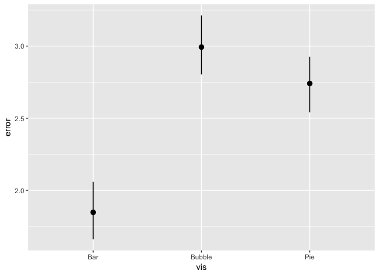
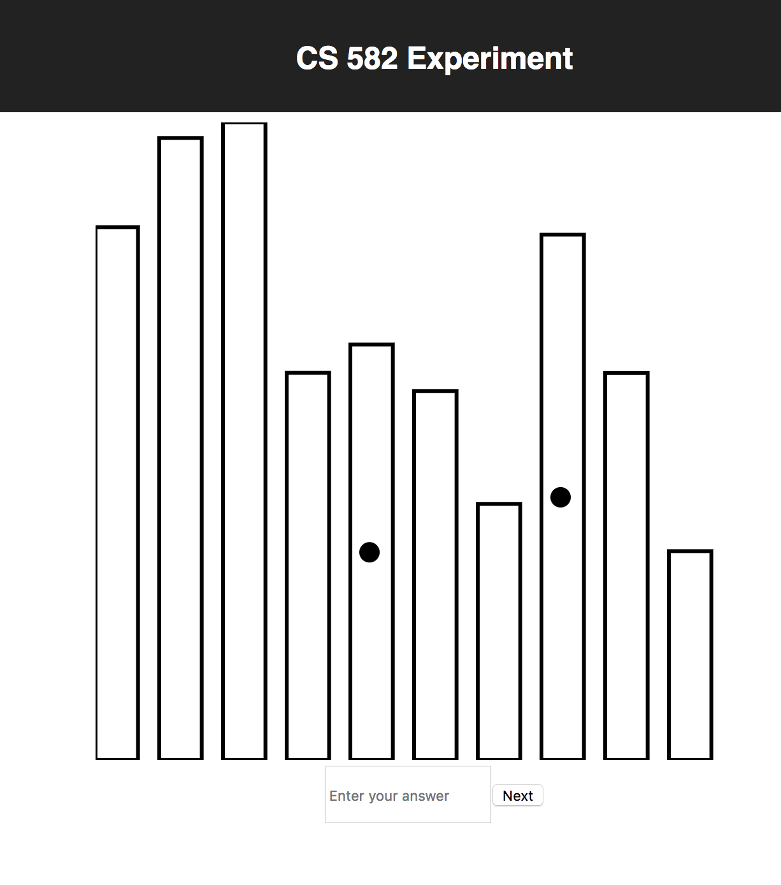
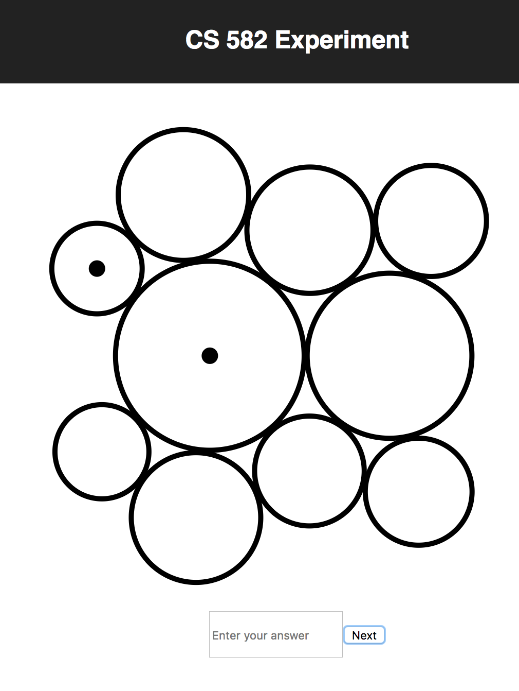
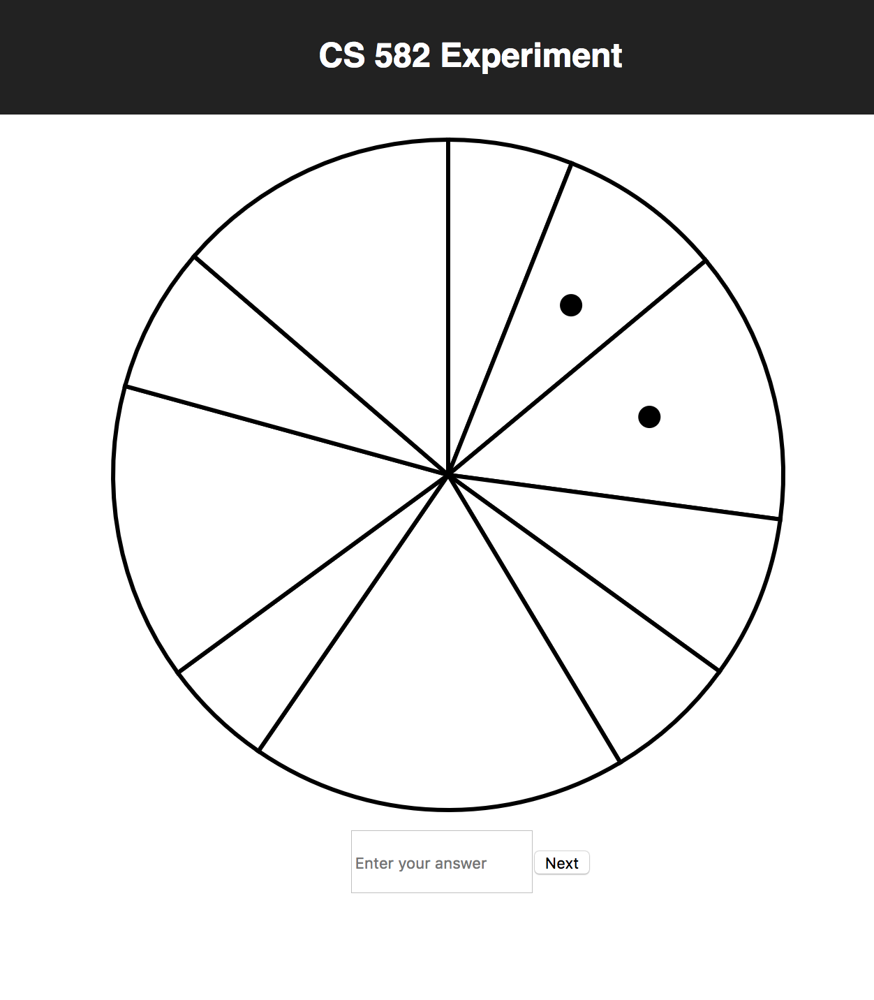

Assignment 3 - Replicating a Classic Experiment  
===

Frank Egan

[Live Experiment Link](https://cs582-experiment.firebaseapp.com)

Experiment Description
---

For this experiment I used bar, pie, and bubble charts for this experiment. Each experiment consisted of 20 charts of each type (bar, pie, bubble) with random data generated as explained in the background paper, with two pieces marked with a dot. Subjects entered their perceived percentages in an input field where the data was then sent to Firebase. From their I downloaded the data from Firebase and added a column in google sheets that contained the log_error calculated with the formula from the background. I then plotted the results by vis type and displayed the bounds of a bootstrapped 95% confidence interval of the mean using StatSummary and ggplot.

Results Chart
--

Chart Types
--

Technical Achievements
---

- Utilized Firebase's new firestore for keeping track of participants data in real time.
- Used React for modularizing chart components, maximizing re-usability.
- Deployed project to Firebase Hosting
- Used redux architecture for loading data and chaining events to send data to Firebase.

Design Achievements
---

- Color blind friendly user interface
- Minimalist design cues
- Very responsive interface for easy data entry
- Wide stroke-width for ease of reading
- Used ggplot in RStudio to display experiment results.